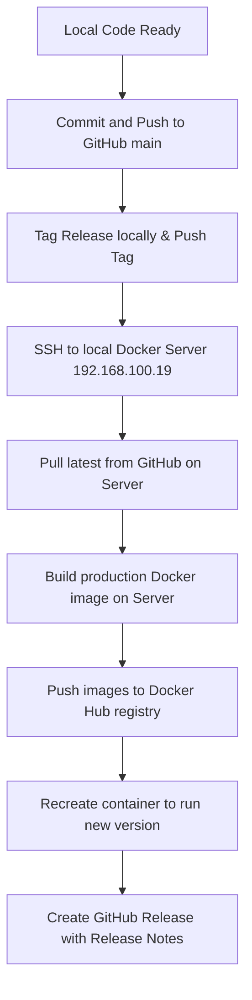

# FamilySync Release and Deployment Guide 🚀

This document details the standardized release pipeline for **FamilySync**, explaining how to tag releases, push updates to GitHub, build production images on the remote Docker server, publish to Docker Hub, and update the live instance.

---

## 📋 Release Pipeline Overview

Whenever a new version of FamilySync is ready (e.g., `v1.2.1`), the release process follows these sequential phases:



---

## 🛠️ Step-by-Step Procedure

### Step 1: Push Changes to GitHub
Ensure all production-ready changes are committed and pushed to the `main` branch of your GitHub repository:
```bash
# Add and commit your changes
git add .
git commit -m "feat: release v1.2.1 - Reports dashboard, Premium Light Theme, and Authenticated Security"

# Push to origin
git push origin main
```

---

### Step 2: Create and Push Git Tags
Tag your release commit using semantic versioning prefixed with `v` (e.g., `v1.2.1`):
```bash
# Create an annotated local tag
git tag -a v1.2.1 -m "Release v1.2.1"

# Push the tag to GitHub
git push origin v1.2.1
```

---

### Step 3: Access the local Docker Server
Connect to your local deployment/build server (`docker-venus` at `192.168.100.19`) via SSH:
```bash
ssh root@192.168.100.19
```

Once connected, navigate to the project directory:
```bash
cd /root/FamilySync
```

---

### Step 4: Pull Latest Changes on the Server
Sync the repository on the remote Docker server with the newly pushed commit from GitHub:
```bash
git pull origin main
```

---

### Step 5: Build and Prepare the Production Container
Run a local multi-stage Docker build to compile the React frontend bundle and wrap it together with the production-only Node/Express backend runner.

Tag the build with both the **version tag** (e.g., `v1.2.1`) and the **`latest` tag**:
```bash
docker build -t gutolm/familysync:latest -t gutolm/familysync:v1.2.1 .
```

---

### Step 6: Push Images to Docker Hub
Push both newly built images to your Docker Hub registry. The Docker server `192.168.100.19` is pre-authenticated for the `gutolm` registry:
```bash
docker push gutolm/familysync:v1.2.1
docker push gutolm/familysync:latest
```

---

### Step 7: Update the Live Running Instance on the Server
To update the running production container on the server to use the newly built image, recreate the compose stack. This guarantees the container picks up the fresh image layers.

Inside `/root/FamilySync` on the remote server:
```bash
# Stop and remove the existing container and network
docker compose down

# Start the new container in detached mode
docker compose up -d
```

#### Verify Running Container Status
Confirm that the new container starts up correctly and has no runtime database or initialization errors:
```bash
# Verify container status
docker ps

# Check production boot logs
docker logs familysync-app
```
*Expected boot logs:*
```text
> familysync-backend@1.2.0 start
> node server.js

Database initialized successfully at: /data/familysync.db
Server running on port 5000
```

---

### Step 8: Create the GitHub Release
Utilize the pre-configured GitHub CLI (`gh`) on the remote Docker server to officially publish the release and its release notes.

1. Write your release notes to a temporary file:
   ```bash
   nano release-notes.md
   ```
2. Create the release on GitHub:
   ```bash
   gh release create v1.2.1 -F release-notes.md -t "Release v1.2.1"
   ```
3. Remove the temporary release notes file to keep the workspace clean:
   ```bash
   rm release-notes.md
   ```

---

## 🔒 Security Practices & Notes
* **Secrets Management**: Never commit your `.env` files or session secrets to Git. The `.env` file on the remote server should remain untracked.
* **Volume Persistence**: Recreating the container via `docker compose down` and `docker compose up -d` is safe and preserves all family data since the SQLite database file is persisted on the `familysync-data` volume mapped to `/data/`.
